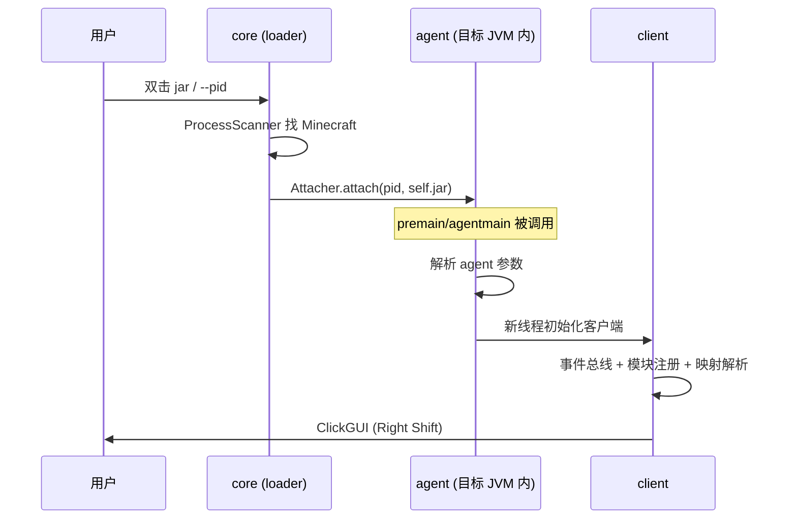

# noturne-client 架构设计

## 1. 总体目标

一个 **JVM 注入式 Minecraft 客户端**，单 jar 同时扮演三种角色：

1. **注入器**（双击 / CLI）：扫描运行中的 Minecraft，把自身作为 agent 注入。
2. **被注入的 agent**（`-javaagent` / attach / mod 加载）：在目标 JVM 内安装客户端。
3. **模组**（Fabric / Forge / NeoForge）：作为普通 mod 被加载，走同一套客户端初始化。

覆盖 **Minecraft 1.8.9 – 26.3**，平台 **Windows / macOS / Linux**。

## 2. 硬性约束

| 约束 | 原因 |
|---|---|
| 目标 JVM 内运行的所有类 **必须编译为 Java 8 字节码（52.0）** | 客户端要注入 1.8.9（JVM 8）。更高版本字节码会被 `UnsupportedClassVersionError` 拒绝 |
| 不引入 Mixin | 运行时改类统一走 JVMTI + ASM，避免对加载器和版本产生额外耦合 |
| 只依赖 Java 8 API（目标 JVM 内代码） | 同上；现代 API（`ProcessHandle`、`List.of`…）禁止出现在 `agent/ client/ ui/` |
| 反射优先 | 1.8.9 与 26.x 的类名/签名差异巨大，跨版本适配层必须能在运行时解析 |

> `core` 是唯一例外：注入器本身运行在用户 JVM（可能是 21），但仍按 release=8 编译以便复用。

## 3. 模块划分

```
noturne-client/
├── core/     注入器与加载器（进程发现 / attach / 载荷 / 多入口分发）
├── agent/    被注入进目标 JVM 的入口（premain / agentmain / Instrumentation）
├── client/   客户端核心（事件总线、模块与值框架、映射与跨版本适配、游戏 wrapper）
└── ui/       自绘 ClickGUI 与 HUD（Epsilon 风格）
```

依赖方向：`ui → client → agent → core`（注入器不依赖客户端，保证能独立启动）。

### 3.1 core

| 组件 | 职责 |
|---|---|
| `Noturne` | `main`：解析参数（`--pid`）、扫描、选择、调用 attach |
| `attach.ProcessScanner` | 跨平台枚举 JVM 进程并识别 Minecraft（tasklist/PowerShell、`ps`） |
| `attach.Attacher` | attach 策略：① 反射 `com.sun.tools.attach.VirtualMachine`；②（后续）自带 `sun.tools.attach.*` 字节码 + 直接调用 attach 原生库，免 `tools.jar` |

### 3.2 agent

被目标 JVM 加载后：

1. `premain(String args, Instrumentation inst)`（`-javaagent` / attach）或
   `agentmain(String args, Instrumentation inst)`（运行时 attach）。
2. 解析 agent 参数（握手 token、配置来源）。
3. 记下 `Instrumentation`，交给 `client` 完成初始化（**必须另起线程**，不在 `premain` 里阻塞类加载）。

### 3.3 client

- **事件总线**：类型化事件（Tick、Packet、Render、Key），支持优先级。
- **模块框架**：`Module` 基类 + `ModuleId` 枚举 + 值体系（Boolean / Number / Mode / Color / Bind）。
- **跨版本适配**：
  - `Mapping` 抽象：把"规范名"翻译成运行时真实名。
  - 模式 A（1.8.9–1.21.x，混淆）：查映射表（MCP / Mojmap / SRG）。
  - 模式 B（26.1+，无混淆）：标识映射 + 反射解析签名（参考 DarkClient 已验证的路径）。
- **游戏 wrapper**：`Minecraft`、`LocalPlayer`、`World`… 只暴露客户端需要的成员。

### 3.4 ui

自绘 ClickGUI / HUD：
- 渲染层抽象（OpenGL 1.x/2.x 兼容 1.8.9，核心 profile 兼容 26.x）。
- 组件树（Panel / Button / Slider / Dropdown / ColorPicker）、主题、字体、动画。

## 4. 注入链



## 5. 载荷与资源

阶段 2 定义自有的载荷封装格式（不复制第三方实现）：

- 资源密文 → 解密 → 解压 → 类表（`名称 → 字节码`）→ 自定义 `ClassLoader` 内存加载，**不落盘**。
- payload 与 native 辅助库分开存放；`k`/`l` 式命名规避字符串扫描。
- 支持"本地内嵌"与"远程更新"双来源，本地优先、按版本号取新。

## 6. 入口矩阵

| 环境 | 元数据 / 入口 | 行为 |
|---|---|---|
| `-javaagent` / attach | `MANIFEST.MF: Premain-Class`, `Agent-Class` | 直接进入 agent 路径 |
| 双击 / `java -jar` | `Main-Class: dev.noturne.core.Noturne` | 扫描并注入 |
| Fabric | `fabric.mod.json` → `entrypoints.main` | 走客户端初始化 |
| Forge | `META-INF/mods.toml` | 同上 |
| NeoForge | `META-INF/neoforge.mods.toml` | 同上 |

所有入口最终汇聚到 `client` 的同一初始化函数。

## 7. 跨版本策略

统一代码 + 运行时适配层，分三段：

| 区间 | 特征 | 适配方式 |
|---|---|---|
| 1.8.9 | Java 8，MCP 名 | 映射表 + JVMTI/ASM 改类 |
| 1.21.x | Java 21，Mojmap 混淆 | 映射表 |
| 26.1+ | Java 21+，无混淆 | 反射解析签名（零映射文件） |

## 8. 阶段计划

见 `docs/PLAN.md`。
