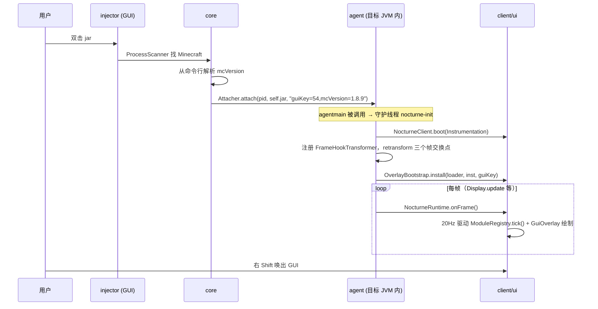

# nocturne-client 架构设计

## 1. 总体目标

一个 **JVM 注入式 Minecraft 客户端**，单 jar 同时扮演两种角色：

1. **注入器**（双击 / CLI / WinUI 套壳）：扫描运行中的 Minecraft，把自身作为 agent 注入。
2. **被注入的 agent**（`-javaagent` / attach）：在目标 JVM 内安装客户端与 GUI 叠加层。

覆盖 **Minecraft 1.8.9 – 26.3**，平台 **Windows / macOS / Linux**。

> 项目**没有**模组形态。Fabric / Forge / NeoForge 的入口类与元数据已删除——
> 模组路径拿不到 `Instrumentation` 就没有帧钩子，而帧回调是整个客户端的驱动源。

## 2. 硬性约束

| 约束 | 原因 |
|---|---|
| 目标 JVM 内运行的所有类 **必须编译为 Java 8 字节码（52.0）** | 客户端要注入 1.8.9（JVM 8）。更高版本字节码会被 `UnsupportedClassVersionError` 拒绝 |
| 不引入 Mixin | 运行时改类统一走 JVMTI + ASM，避免对加载器和版本产生额外耦合 |
| 只依赖 Java 8 API（目标 JVM 内代码） | 现代 API（`ProcessHandle`、`List.of`…）禁止出现在 `agent/ client/ ui/` |
| 反射优先 | 1.8.9 与 26.x 的类名/签名差异巨大，跨版本适配层必须能在运行时解析 |
| ASM 变换不得用 `COMPUTE_FRAMES` | 自定义 ClassLoader 下 `getCommonSuperClass` 会崩。改用 `ClassWriter(reader, COMPUTE_MAXS)` + `reader.accept(visitor, 0)` 保留原 StackMapTable |
| 异常绝不传播回被补丁的游戏方法 | 帧回调是插桩进去的，一个未捕获异常会让游戏崩在任意位置 |

## 3. 模块划分与依赖

```
nocturne-client/
├── core/        注入侧：进程发现、attach、载荷容器、CLI 入口
├── injector/    注入器 GUI（Swing + FlatLaf + MigLayout）
├── agent/       被注入侧：premain/agentmain 接线、帧钩子与绘制钩子、叠加层装配
├── client/      客户端核心：模块与值框架、事件总线、映射层、反射桥、bootstrap 层分发器
├── ui/          自绘 ClickGUI 与 HUD（四个绘制后端，见 3.4）
├── dist/        纯聚合模块（无源码），合并上述五者成单 jar
├── launcher/    Windows 启动器壳（WPF / .NET 8）——**不在 Gradle 构建内**，见 3.6
├── tools/mapping/  映射表生成器（Python）——**不在 Gradle 构建内**
└── vendor/      第三方源码快照（Setsuna / Vape）——只作参考与许可留存，不参与构建
```

依赖图是**森林**，不是链：

```
injector ──→ core                (注入侧：GUI 依赖注入逻辑)
agent ──→ client, ui             (被注入侧：agent 同时是 ui 的宿主)
ui ──────→ client
core, client                     (叶子)
dist ────→ 全部
launcher ──→ (无编译期依赖)        (运行期把 dist jar 当子进程驱动)
```

`core` 与 `client` 都是叶子，没有循环依赖。注入器不依赖客户端，因此能独立启动。

### 3.1 core（注入侧）

| 组件 | 职责 |
|---|---|
| `Nocturne` | `main`：工具 jar 自举 → 解析 `--pid`/`--list-json` → 扫描 → `Attacher.attach` |
| `attach.ProcessScanner` | 跨平台枚举 JVM 进程并识别 Minecraft（Windows `tasklist /V` + PowerShell CIM；Unix `ps -e -o pid=,comm=,args=`） |
| `attach.Attacher` | attach 策略链：`JdkAttachStrategy` 打头（JDK 自带 API，存在即最快），失败后按平台再试 `WindowsAttachStrategy`（Windows）或 `PosixAttachStrategy`（Linux/macOS）；`attach` 返回胜出策略名，CLI 据此打印 `attach strategy: <name>` |
| `attach.JdkAttachStrategy` | 反射 `com.sun.tools.attach.VirtualMachine`；容忍 JDK 9+ 客户端对 JDK 8 目标的响应格式误报 |
| `attach.WindowsAttachStrategy` / `attach.WindowsAttachNative` / `attach.NativeLibraryLoader` | 自实现 attach（Windows x64）：从 jar 资源解出 `native/windows-x64/nocturne-attach.dll`，用 Toolhelp 枚举目标模块、读其 `jvm.dll` 的 PE32+ 导出表解析 `JVM_EnqueueOperation`，按 Win64 ABI 用远线程桩投递 `load`，再经服务端命名管道读回结果。**已在官方 1.8.9 真机 + 裁剪 JRE 上实测通过**，全程不触碰 `jdk.attach`/`tools.jar` |
| `attach.PosixAttachStrategy` / `attach.PosixAttachNative` | 自实现 attach（Linux/macOS）：直连目标在 `<tmpdir>/.java_pid<pid>` 的 attach 监听域套接字（连接前校验该套接字属本用户），写入 `AttachProtocol` 线字节并读回结果；`native/{linux,macos}-<arch>/nocturne-attach.{so,dylib}` 由 `cc` 现地编译。**仅完成编译级校验（WSL gcc `-Werror`）与单测，尚未实机验证** |
| `attach.ToolsJarBootstrap` | JDK 8 下用带 `tools.jar` 的 classpath 重启自身 |
| `attach.AgentOptions` | 组装 `guiKey=<AWT VK>,mcVersion=<版本族>`；版本从目标命令行归一化 |
| `pack.PayloadPack` / `load.MemoryClassLoader` | AES-256-GCM + deflate 的载荷容器与内存类加载器。**已实现且有测试，但生产零调用** |

### 3.2 agent（被注入侧）

1. `premain` / `agentmain` → 同一个 `start()`，`AtomicBoolean` CAS 保证幂等。
2. 解析 agent 参数 `guiKey=`（畸形输入一律回退 `VK_RIGHT_SHIFT`）。
3. 在**守护线程** `nocturne-init` 上依次 `boot → installFrameHook → installOverlay`
   （在 `premain` 里同步初始化会拖死待插桩 JVM 的类加载）。
4. 两个 ASM9 转换器（未命中或解析失败一律返回 `null`，JVM 沿用原字节码——**绝不让插桩导致类加载失败**）：
   - `FrameHookTransformer`：在三个帧交换点织入**无参**调用 `NocturneRuntime.onFrame()`——
     `org/lwjgl/opengl/Display.update()V` / `org/lwjgl/glfw/GLFW.glfwSwapBuffers(J)V` /
     `org/lwjgl/sdl/SDLVideo.SDL_GL_SwapWindow(J)Z`（LWJGL2 / GLFW 两代用；SDL 栈不注册，见下）。
   - `CallbackHookTransformer`：把目标方法的**首个引用形参**交给钩子（描述符固定
     `(Ljava/lang/Object;)V`），可插在方法**开头**或**末尾**。末尾用于绘制入口——目标方法自己也要往
     同一个绘制上下文里画，插在开头的内容会被它随后画的内容盖住。26.x 用它接两个绘制入口
     （`Hud.extractRenderState`、`Screen.extractRenderStateWithTooltipAndSubtitles`）驱动 `GuiDrawHook`。
5. `EmbeddedAsmLoader` 用 child-first 子加载器从内嵌的加密载荷
   `dev/nocturne/agent/asm.pack`（`PayloadPack`：deflate + AES-256-GCM）解包出 ASM
   （同时覆盖转换器自身的类，否则它 import 的 ASM 解析不到内嵌副本）。
6. `OverlayBootstrap` 是**延迟安装器**（自身实现 `FrameListener`）：每帧重解析游戏类加载器
   里的 `GL11`，等第一帧真到来再装叠加层，成功后自摘。上限 600 次。SDL 栈（26.x）下 GL 全进程
   不可用，因此改走游戏自己的 `GuiGraphicsExtractor`（后端 `ExtractorRenderer`），由绘制钩子每帧把
   当帧绘制上下文喂进来；那个汇放在 **bootstrap 层**（见 3.5）——钩子与后端分属两个类加载器。

### 3.3 client（客户端核心）

- **模块框架**：`Module` 基类 + `ModuleRegistry`（按名唯一、分类查询、驱动闸门）
  + 值体系（`BooleanValue` / `NumberValue` / `ColorValue` / `ModeValue`）。
  分类只有 4 个：`MOVEMENT` / `RENDER` / `PLAYER` / `MISC`。
- **事件总线**：`EventBus`，同步、按订阅顺序、逐订阅者异常隔离。
  已有 Tick / Packet / Render / Input 四类事件并接生产（Tick 广播 + 直调、Render 每帧广播）。
- **跨版本适配**：
  - `Mapping` 抽象：把"规范名"翻译成运行时真实名。
  - `IdentityMapping`（26.1+，无混淆，原样返回）。
  - `ObfuscatedMapping`（查 `/mappings-<版本族>.json`，schema v2：每类/成员带
    `vanilla`/`fabric`/`forge`/`neoforge` 四套运行期名与配套 JNI 描述符，按候选顺序试；
    缺项由生成器标 `"absent": true`，运行期回退规范名并打一次性诊断日志）。
- **反射桥**：`GameBridge` 提供类解析（含限流重试）、映射字段读写、映射方法调用
  （描述符消歧 / 恒等映射下按实参推导重载）与成功缓存。**没有有类型的 wrapper 对象**——
  `player()` 返回裸 `Object`。
- **运行时**：`NocturneRuntime.onFrame()` 是帧广播器，四层防御：
  ThreadLocal 重入 → `tryLock` 非阻塞 → 逐监听器 `catch(Throwable)` → 最外层兜底。
  按 50ms 折算成 20Hz 驱动 `ModuleRegistry.tick()`。状态全在 bootstrap 层的 `FrameDispatcher`（见 3.5）。
- **HUD 接缝**：`HudSink`（`add`/`remove`/`has`）；`ui` 侧实现是 `SkijaHudSink`，由 `OverlayBootstrap`
  在 Skija 后端下接上（其余后端 HUD 暂不可用）。

### 3.4 ui（自绘 ClickGUI / HUD）

- 渲染抽象 `Renderer`（rect / roundedRect / outline / text / pushClip / popClip）
  + `UiBackend`（+ beginFrame/endFrame/backendName/width/height/ready）。
- 四个后端（都挂在 `UiBackend` 下，由 `OverlayBootstrap.selectBackend` 按栈挑选）：
  `GlRenderer`（固定管线，`glOrtho` + `glScissor` 裁剪栈；≤1.12）、
  `ModernRenderer`（核心 profile，GLSL 150 + 单 VBO/VAO，颜色走 uniform；1.13–26.2）、
  `ExtractorRenderer`（26.x SDL 栈：**完全不碰 GL**，把原语翻译成游戏自己的 `GuiGraphicsExtractor`
  调用——`fill` 收左上/右下两角、`outline` 收左上+宽高、`enableScissor`/`disableScissor` 裁剪、
  `text(Font,…)` 画字；圆角无原语，逐行内缩近似）、
  `SkijaBackend`（Skija 画布，Multi-Release JAR 在 Java 8 可用）。后两者当前都不在 LWJGL2 / 核心
  profile 路径上被 probe：Skia 直写外部帧缓冲会盖黑游戏（修法是纹理中转，未做）。
- 输入四路：`ReflectiveInput` 绑 lwjgl2 / glfw（GLFW 滚轮走动态代理回调并转发被顶掉的旧回调）、
  `GameInput`（SDL 世代：**鼠标取游戏自己的事件态**——`MouseHandler.xpos/ypos` + `activeButton`，
  因为 `SDL_GetMouseState` 在"无鼠标焦点"时静默给 0,0；见 VERSION-MATRIX P5-C）、
  `SdlInput`（26.x SDL3：轮询 `SDL_GetMouseState` / `SDL_GetKeyboardState`；**SDL 的滚轮是事件驱动、
  没有轮询接口，仍为已知缺口**）；三代都解析不出时退化为 `NoInput`。
- 组件树、主题、字体、动画、分类栏拖动、滚轮、右键设置面板、指针捕获交接。
- HUD：`SetsunaHud` / `HudManager` 挂在 `SkijaHudSink` 上；非 Skija 后端（含 26.x）HUD 暂不可用。

### 3.5 runtime（bootstrap 层的全局状态）

`FrameDispatcher` / `FrameListener` 被追加到 **bootstrap** 搜索路径
（`NocturneAgent.installBootstrapBridge`），并由 `NocturneRuntime` 用
`Class.forName(name, true, null)` **强制从 bootstrap 取用**。

原因：注入到游戏方法里的那条调用由游戏的**隔离类加载器**（Fabric 的 `KnotClassLoader`）解析，
而它会把认得的所有 jar 各加载一遍——**本项目任何类都会出现两份**，静态状态各存一份。实测现象：
帧回调连续触发，但监听器列表恒为 0，界面永远不出现。因此所有跨加载器的静态状态（监听器列表、
绘制上下文汇）都必须放在 bootstrap 层，对外只传 JDK 类型（`Runnable` / `Consumer`），
避免"同名接口但不是同一个类型"的类型错误。

### 3.6 launcher（WPF 壳）

`launcher/` 是一个独立的 .NET 8 / WPF 项目（`NocturneLauncher.exe`），**不在 Gradle 构建内**。
它刻意保持极薄：不链接 jar 中的任何类型，只把 jar 当子进程驱动（`--list-json` / `--pid=`），
因此客户端升级后无需重新编译这个壳。它也是 `nocturne.bat` 之外的另一条启动路径。

## 4. 注入链



## 5. 载荷与资源

`PayloadPack` 定义了自有封装格式（不复制第三方实现）：

```
MAGIC 'NTPK'(4) | VERSION(1) | nonce(12) | AES-256-GCM 密文 + 16B 标签
明文 = deflate( int count + (writeUTF 名称, int 长度, 字节)* )
```

`MemoryClassLoader` 内存优先（表内即 `defineClass`，允许遮蔽），表外委派父加载器且不持锁；
`getResource`/`getResourceAsStream` 用自定义 `memory:` `URLStreamHandler` 提供内存资源。
解析有硬上限（条目数 ≤ 2²⁰、单条 ≤ 64MiB、明文 ≤ 512MiB、拒绝重名），inflate 带无进展自旋保护。

**现状：已接入生产**——内嵌 ASM 不再以明文 jar 资源分发，改为构建期由 `PayloadTool asm-pack`
加密成 `dev/nocturne/agent/asm.pack`，agent 侧 `EmbeddedAsmLoader` 用同一密钥在内存解包加载
（`PayloadKey` 的种子写在代码里，只提高零成本静态扫描门槛，不构成对定向逆向的防护）。

## 6. 入口矩阵

| 环境 | 入口 | 行为 |
|---|---|---|
| `-javaagent` / attach | `MANIFEST.MF: Premain-Class`, `Agent-Class` = `dev.nocturne.agent.NocturneAgent` | 直接进入 agent 路径 |
| 双击 / `java -jar` | `Main-Class: dev.nocturne.injector.InjectorApp` | 双击出 GUI；参数含 `--list-json` 或 `--pid=<n>` 时**在启动 GUI 之前**转发给 `dev.nocturne.core.Nocturne` 走命令行 |
| WinUI/WPF 套壳 | `launcher/`（独立 C# 进程） | 靠 `--list-json` / `--pid=` 子进程协议驱动 jar，**不链接 jar 内任何类型** |

## 7. 跨版本策略

统一代码 + 运行时适配层。**版本由注入器传入（`mcVersion=` attach 选项），运行时零探测**：

| 区间 | 特征 | 适配方式 |
|---|---|---|
| 1.8.9 | Java 8，MCP 名 | 映射表 + 帧钩子（`Display.update`）+ GL 固定管线 |
| 1.12 – 1.21.x | 混淆 | 映射表（66 个 release 全部产出）+ 帧钩子（GLFW 交换点）+ 核心 profile 渲染 |
| 26.1 – 26.2 | Java 21，无混淆，SDL3 | 反射解析 + 核心 profile 渲染（SDL 栈上未实机验证） |
| 26.3 | Java 21，无混淆，SDL3 | **不注册帧钩子**；绘制走游戏自己的 `GuiGraphicsExtractor`，输入走 `GameInput`（鼠标取游戏事件态，键走 SDL 键盘状态） |

## 8. 阶段计划

见 `docs/PLAN.md`。版本能力矩阵见 `docs/VERSION-MATRIX.md`。
